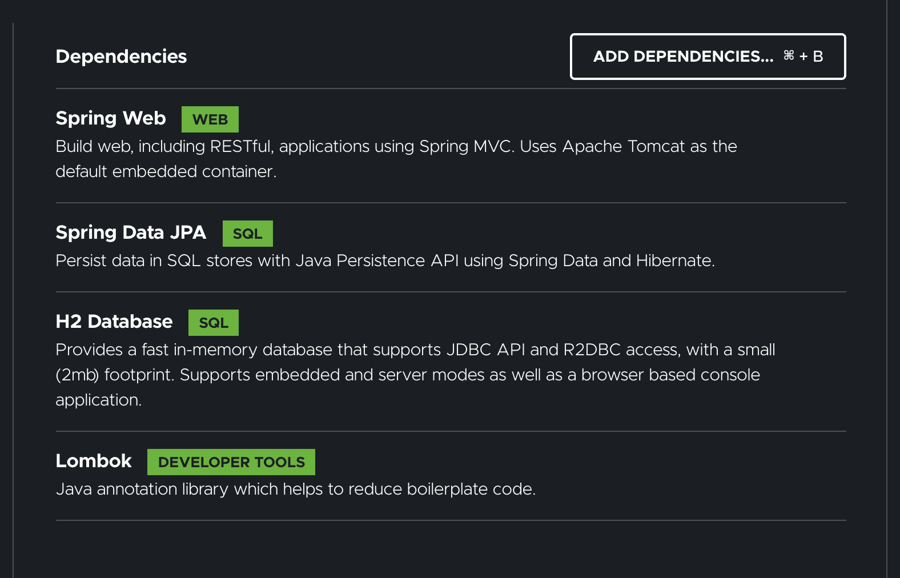

# 프로젝트 환경설정

### Querydsl

 : 쿼리를 자바 코드로 작성, 문법 오류를 컴파일 시점에 잡아줌, 동적 쿼리 문제 해결, 쉬운 SQL 스타일 문법

 재사용성도 높음
<br><br>

**스프링 데이터 JPA + Querydsl = 개발이 환상적이됨**

: 단순 반복 코드들이 확연히 줄어든다. 개발자들이 핵심 비즈니스로직을 작성하는데 집중할 수 있음

  쿼리도 자바코드로 작성할 수 있다.

= 선택이 아닌 필수.
<br><br>

인강은 기초문법부터 ~ 실무 노하우 전수를 소개할 예정
<br><br>

## 프로젝트 생성

이번엔 gradle! 기본 dependencies 추가




: 그래들이 처음 실행될 때, java 가 실행되는게 아니라 실행을 gradle한테 위임하는 것으로 기본 설정이 되어있다.

이 부분을 intellij로 바꿔주면 조금 더 빠른 실행 결과를 얻을 수 있다.
<br>
<br><br>
**IntelliJ Gradle 대신에 자바로 바로 실행하기**
  최근 IntelliJ 버전은 Gradle로 실행을 하는 것이 기본 설정이다. 이렇게 하면 실행속도가 느리다.       

  다음과 같이 변경하면 자바로 바로 실행하므로 좀 더 빨라진다.
1. Preferences Build, Execution, Deployment Build Tools Gradle
2. Build and run using: Gradle IntelliJ IDEA
3. Run tests using: Gradle IntelliJ IDEA

**롬복 적용**
1. Preferences plugin lombok 검색 실행 (재시작)
2. Preferences Annotation Processors 검색 Enable annotation processing 체크 (재시작)
3. 임의의 테스트 클래스를 만들고 @Getter, @Setter 확인
<br>
<br>

### Querydsl 설정과 검증

```groovy
//querydsl 추가
 id "com.ewerk.gradle.plugins.querydsl" version "1.0.10"

//querydsl 추가
 implementation 'com.querydsl:querydsl-jpa'

//querydsl 추가 시작 : 빌드 관련 
def querydslDir = "$buildDir/generated/querydsl"
querydsl {
 jpa = true
 querydslSourcesDir = querydslDir
}
sourceSets {
 main.java.srcDir querydslDir //source폴더로 인식
}
configurations {
 querydsl.extendsFrom compileClasspath
}
compileQuerydsl {
 options.annotationProcessorPath = configurations.querydsl 
}
//querydsl 추가 끝
```


클릭하면 Q파일 생성 : 빌드만해도 생성 : git에서 관리하면 안됨. (git ignore 설정해줘야함) (build 폴더는 자동 Ignore)


해당 폴더를 소스코드로 감지

> project structure 단축키: command + ;
prefrence 단축키: command + ,
> 

> 터미널에서 ./gradlew clean : 빌드폴더 지우기
./gradlew compile querydsl : 컴파일 후, 빌드에 querydsl 폴더 생성
./gradlew compile java : 결과 똑같음
> 

<br><br>
### 테스트

```java
@SpringBootTest
@Transactional
class QuerydslApplicationTests {

	@Autowired
	//@PersistenceContext //나 이거 첨봐..!! springframework 공식..?
	EntityManager em;

	@Test
	void contextLoads() {
		Hello hello = new Hello();
		em.persist(hello);

		JPAQueryFactory query = new JPAQueryFactory(em);
		//QHello qHello = new QHello("h");
		QHello qHello = QHello.hello; // 이렇게 써두됨 이미 선언 되어있음

		Hello result = query.selectFrom(qHello)
				.fetchOne();

		//Assertions.assertThat() //옵션+엔터로 Assertion을 static으로 바꿈
		assertThat(result).isEqualTo(hello);
		assertThat(result.getId()).isEqualTo(hello.getId()); //lombok test
	}

}
```
<br>
<br>
### 라이브러리 살펴보기

터미널에서 실행

```java
./gradlew dependencies --configuration compileClasspath
```

혹은


: 실제 애플리케이션 쿼리 작성할 때 필요한 라이브러리

강의에서 설명하는 querydsl-apt는 없어진듯

> [querydsl.com](http://querydsl.com) 
: 다양한 쿼리들을 같은 경험으로 제공하는 것 : spring data project 비슷..(common 밑에 jpa..redis..등)
> 

<br><br>
**주요 라이브러리**


: 중요한 라이브러리 한번씩 다시 짚어주심

logback : slf4j의 구현체
<br><br>

**Querydsl 라이브러리 살펴보기**

- querydsl-apt: Querydsl 관련 코드 생성 기능 제공
- querydsl-jpa: querydsl 라이브러리

**스프링 부트 라이브러리 살펴보기**

- spring-boot-starter-web
    - spring-boot-starter-tomcat: 톰캣 (웹서버)
    - spring-webmvc: 스프링 웹 MVC
- spring-boot-starter-data-jpa
    - spring-boot-starter-aop
    - spring-boot-starter-jdbc
        - HikariCP 커넥션 풀 (부트 2.0 기본)
    - hibernate + JPA: 하이버네이트 + JPA
    - spring-data-jpa: 스프링 데이터 JPA
- spring-boot-starter(공통): 스프링 부트 + 스프링 코어 + 로깅
    - spring-boot
        - spring-core
    - spring-boot-starter-logging
        - logback, slf4j

**테스트 라이브러리**

- spring-boot-starter-test
    - junit: 테스트 프레임워크, 스프링 부트 2.2부터 junit5( jupiter ) 사용
        - 과거 버전은 vintage
    - mockito: 목 라이브러리
    - assertj: 테스트 코드를 좀 더 편하게 작성하게 도와주는 라이브러리
        - https://joel-costigliola.github.io/assertj/index.html
    - spring-test: 스프링 통합 테스트 지원
- 핵심 라이브러리
    - 스프링 MVC
    - JPA, 하이버네이트
    - 스프링 데이터 JPA
    - Querydsl
- 기타 라이브러리
    - H2 데이터베이스 클라이언트
    - 커넥션 풀: 부트 기본은 HikariCP
    - 로깅 SLF4J & LogBack
    - 테스트
<br><br>
### H2 데이터베이스 설치

개발이나 테스트 용도로 가볍고 편리한 DB, 웹 화면 제공

- https://www.h2database.com
- 다운로드 및 설치
- h2 데이터베이스 버전은 스프링 부트 버전에 맞춘다.
- 권한 주기: chmod 755 h2.sh
  
    
    
- 데이터베이스 파일 생성 방법
    - jdbc:h2:~/querydsl (최소 한번)
    - ~/querydsl.mv.db 파일 생성 확인
      
        
        
        
        
        홈에 해당 파일 생성 → db 파일
        
    - 이후 부터는 jdbc:h2:tcp://localhost/~/querydsl 이렇게 접속
      
        
        
           : tcp 모드
        

> 참고: H2 데이터베이스의 MVCC 옵션은 H2 1.4.198 버전부터 제거되었습니다. 이후 부터는 옵션 없이
사용하면 됩니다.
> 

> > 주의: 가급적 안정화 버전을 사용하세요. 1.4.200 버전은 몇가지 오류가 있습니다.
> 현재 안정화 버전은 1.4.199(2019-03-13) 입니다.
> 다운로드 링크: https://www.h2database.com/html/download.htm
> 
<br><br>
### 스프링 부트 설정 - JPA,DB

```yaml
spring:
  datasource:
    url: jdbc:h2:tcp://localhost/~/querydsl
    username: sa
    password:
    driver-class-name: org.h2.Driver

  jpa:
    hibernate:
     ddl-auto: create #살행 시점에 테이블 다 drop하고 다시 생성하는 것.
  properties:
     hibernate:
     #show_sql: true #systemout 으로 출력
     format_sql: true 
logging.level:
  org.hibernate.SQL: debug   #sql이 로그로 출력됨
# org.hibernate.type: trace #sql문이 남겨질 때 ?가 뭔지 남겨짐
```

create-drop : 프로그램 종료할 때 다 날려버림
<br><br>
**2번째 방법**
* 외부 라이브러리 사용
https://github.com/gavlyukovskiy/spring-boot-data-source-decorator
스프링 부트를 사용하면 이 라이브러리만 추가하면 된다.

```groovy
implementation 'com.github.gavlyukovskiy:p6spy-spring-boot-starter:1.5.8
```
<br><br>
> > 참고: 쿼리 파라미터를 로그로 남기는 외부 라이브러리는 시스템 자원을 사용하므로, 개발 단계에서는
편하게 사용해도 된다. 하지만 운영시스템에 적용하려면 꼭 성능테스트를 하고 사용하는 것이 좋다.
> 
<br><br>
### 추가 테스트

```java
@SpringBootTest
@Transactional //test에 이게 있으면 기본적으로 rollback을 해버림
@Commit
class QuerydslApplicationTests {
```


